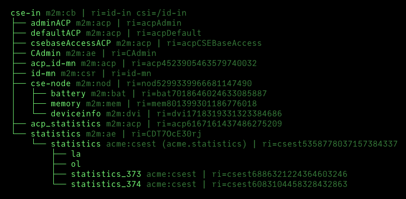

[← README](../README.md) 

# Command Console

The CSE has a command console interface to execute build-in commands. The following commands are available:

	┏━━━━━━━┳━━━━━━━━━━━━━━━━━━━━━━━━━━━━━━━━━━━━━━━━━━━━━━━━━━━━━━━━┳━━━━━━━━┓
	┃ Key   ┃ Description                                            ┃ Script ┃
	┡━━━━━━━╇━━━━━━━━━━━━━━━━━━━━━━━━━━━━━━━━━━━━━━━━━━━━━━━━━━━━━━━━╇━━━━━━━━┩
	│ h, ?  │ This help                                              │        │
	│ A     │ About                                                  │        │
	│ Q, ^C │ Shutdown CSE                                           │        │
	│ c     │ Show configuration                                     │        │
	│ C     │ Clear the console screen                               │        │
	│ D     │ Delete resource                                        │        │
	│ E     │ Export resource tree to *init* directory               │        │
	│ G     │ Plot graph (only for container)                        │        │
	│ ^G    │ Plot & refresh graph continuously (only for container) │        │
	│ i     │ Inspect resource                                       │        │
	│ I     │ Inspect resource and child resources                   │        │
	│ k     │ Catalog of scripts                                     │        │
	│ ^K    │ Show resource continuously                             │        │
	│ l     │ Toggle screen logging on/off                           │        │
	│ L     │ Toggle through log levels                              │        │
	│ r     │ Show CSE registrations                                 │        │
	│ s     │ Show statistics                                        │        │
	│ ^S    │ Show & refresh statistics continuously                 │        │
	│ t     │ Show resource tree                                     │        │
	│ T     │ Show child resource tree                               │        │
	│ ^T    │ Show & refresh resource tree continuously              │        │
	│ u     │ Open web UI                                            │        │
	│ w     │ Show workers and threads status                        │        │
	│ =     │ Print a separator line to the log                      │        │
	├───────┼────────────────────────────────────────────────────────┼────────┤
	│ Z     │ Reset and restart the CSE                              │   ✔︎    │
	└───────┴────────────────────────────────────────────────────────┴────────┘

[Script commands](ACMEScript.md) with configured [key binding](ACMEScript-metatags.md#meta_onkey) are shown in addition to
the build-in commands.

**Example**  
The CSE's resource tree can be shown by pressing the `t` key:

### Hiding Resources in the Console's Tree

Sometimes it could be useful in demonstrations if one would be able to hide resources from the console's resource tree.
That can be accomplished by listing these resources in the setting *[cse.console].hideResources*. 
Simple wildcards are allowed in this setting.

Example to hide all resources with resource identifiers starting with 'acp':

	[cse.console]
	hideResources=acp*

### Exporting Resources

One of the tasks the CSE performs during start-up is that it imports resources located in the *init* directory. 
This builds up an initial resource tree. See [Importing Resources](Importing.md#resources) for a more detailed description.

With the console command "E - Export resource tree to *init* directory" one can export the current state of the resource 
tree to the *init* directory as a [ACMEScript script](ACMEScript.md) so that it can be imported again automatically 
during the next CSE start-up, or reset. The structured resource path and the resource type are taken for the filename of the 
resources, and should be therefore easily identifiable.

Resource that have been imported this way are ignored in the export to avoid conflicts.

## Supported Function Keys

The consoles and their emulations of different operating systems support different sets of function key bindings. The following
table lists the names that can be used, e.g. in scripts.

| POSIX (Linux, Mac OS)                                                                                  | MS Windows                                               |
|--------------------------------------------------------------------------------------------------------|----------------------------------------------------------|
| CTRL_A - CTRL_Z                                                                                        | CTRL_A - CTRL_Z                                          |
| F1 - F12 Modifiers: SHIFT                                                                           | F1 - F12 Modifiers: SHIFT, CTRL, ALT                  |
| UP, DOWN, LEFT, RIGHT, HOME, END Modifiers: SHIFT, CTRL, ALT, SHIFT_ALT, SHIFT_CTRL, SHIFT_CTRL_ALT | UP, DOWN, LEFT, RIGHT, HOME, END Modifiers: CTRL, ALT |
| PAGE_UP, PAGE_DOWN Modifiers: ALT                                                                   | PAGE_UP, PAGE_DOWN Modifiers: CTRL, ALT               |
| INSERT, DEL, BACKSPACE, LF, CR, SPACE                                                                  | INSERT, DEL, LF, CR, SPACE                               |
| TAB Modifiers: SHIFT                                                                                | BACKSPACE, TAB Modifiers: CTRL                        |

Note, that modifiers are prepend to key names with an underline, e.g. `SHIFT_CTRL_UP`.

[← README](../README.md) 
